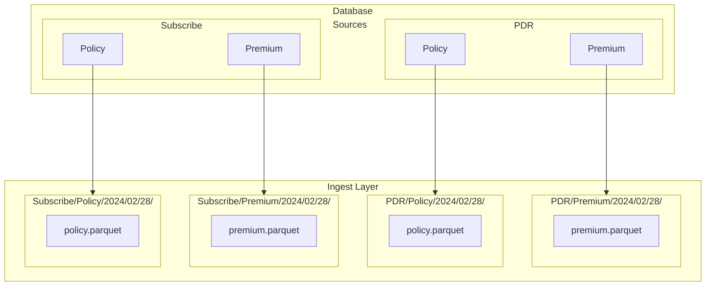

# Big Data Management Example A
Although there is no single fixed data zoning methodology, many varieties of data zone names and conventions exist.  However, in abstract the following 3 data lake zones are usually represented. These can be thought of visually as layers:  
1. Ingestion Layer
2. Warehouse/Lakehouse Layer
3. Consumer Layer

## 1. Ingestion Layer
In a Lakehouse, the ingestion layer represents the data lake, in that it is an immutable store of all source data being ingested.  The period of immutability can be months, years or infinite (although cost can become a factor in large-scale environments). This data remains unprocessed, uncomformed and free of any changes or corrections.  In this way, any Lakehouse datasets/marts can always be fully rebuilt.  

Ingestion layer data needs to be protected from changes, deletions and updates.   The purpose of this layer is not to makes sense of the data, or to apply context.  It is only to store/persist the data in a way that it can be predictably discovered and used by processes which require it.  

A simple example of a daily database table ingest is shown below.  
 

 

The datasets created in this layer represent a direct copy of the entities being ingested.  
**DB Tables**  
Because database table copies are stored in compressed formats such as Parquet, there is no need to project (select) columns, although for large data tables, a filter to retrieve new or changed records is an advantage.  For tables where changes cannot be identified, the entire table can be copied at every ingest frequency.  
**Files**  
File-based data such as JSON or XML should be stored in their native formats.  Although these formats are not compressed, they generally represent smaller data payloads such as messages or more targeted and specific content.  
 
  
## 2. Warehouse/Lakehouse Layer

