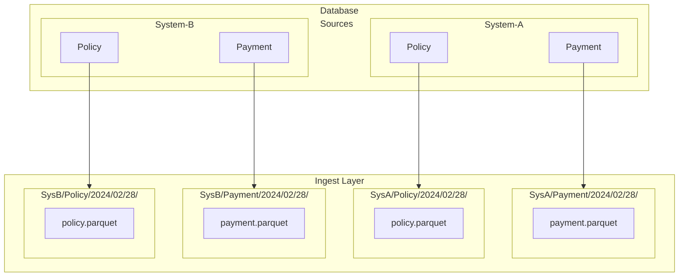
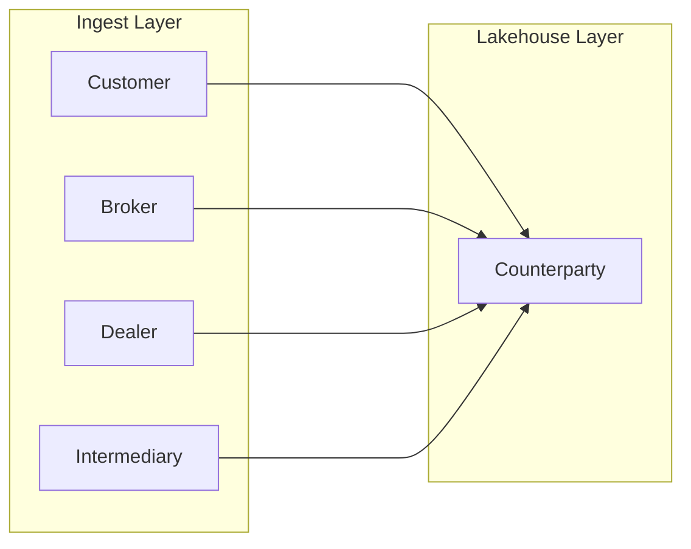
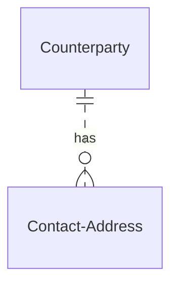
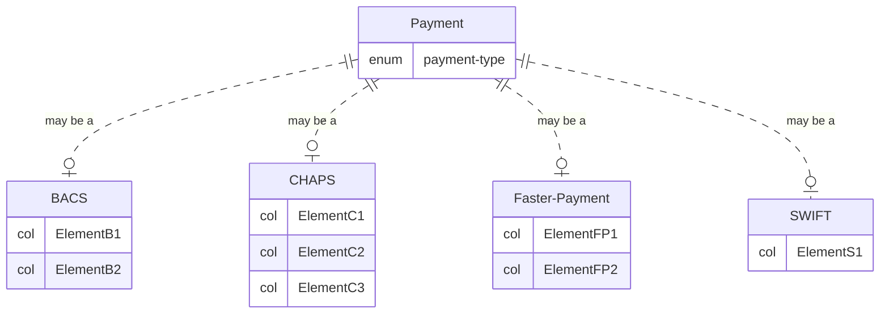

# Big Data Management Example A
Although there is no single data zoning taxonomy, many varieties of data zone names and conventions exist.  However, in abstract the following 3 data lake zones are usually represented. These can be thought of visually as layers:  
1. Ingestion Layer
2. Lakehouse Layer
3. Consumer Layer

## 1. Ingestion Layer
The Ingestion Layer is a collection of all data to be centralised, whether it will be used by any data consumers or not.  

In a Lakehouse appliance or ecosystem, the ingestion layer represents the data lake, in that it is an immutable store of all source data being ingested.  The period of immutability can be months, years or infinite (although cost can become a factor in large-scale environments). This data remains unprocessed, uncomformed and free of any changes or corrections.  In this way, any Lakehouse datasets/marts can always be fully rebuilt.  
Additionally, original data formatting is never lost and the lake contains an archive of data that can be useful for many scenarios such as historical analysis, business process replay, or to restore data to operational systems which need recovery.  

Ingestion layer data needs to be protected from changes, deletions and updates.   The purpose of this layer is not to makes sense of the data, or to apply context.  It is only to store/persist the data in a way that it can be predictably discovered and used by processes which require it.  

The most common method of enabling this type of improved data governance and data management for Ingest layers, is to create a well-understood partition scheme.  
On data lake file systems (large-scale object stores,  HDFS, etc.), this equates to a folder structure.  
```bash
├── Ingest Layer
│   ├── DataSource
│   │   └── DataEntity
│   │       └── Year/Month/Day
│   │           └── DataFile001
│   │           └── DataFile002
│   │           └── ...
│   └── DataSource
│   │   └── DataEntity
│   │       └── Year/Month
│   │           └── DataFile001
│   └── DataSource
├── Lakehouse Layer
└── Consumer Layer
```

This simple organisation allows many data management features to be applied.  For example, rules can be created for automatic metadata tagging of business context (within data governance tools), application of data access policies, and automatic execution of archival/deletion processes.  

A simple example of a daily database table ingest of a generic financial policy with payments is shown below.  
<br>


<br>

The datasets created in this layer represent a direct copy of the entities being ingested.  
**DB Tables**  
Because database table copies are stored in compressed formats such as Parquet, there is no need to project (select) columns, although for large data tables, a filter to retrieve new or changed records is an advantage.  For tables where changes cannot be identified, the entire table can be copied at every ingest frequency.  
**Files**  
File-based data such as JSON or XML are usually stored in their native formats.  Although these formats are not compressed, they generally represent smaller data payloads such as messages or more targeted and specific content.  
<br>
  
## 2. Lakehouse Layer
The Lakehouse layer contains the superset of all data that is required by data consumers.  
The technology term 'Lakehouse' is a portmanteau of data-lake and data-warehouse.  

**Data-Lake**  
In terms of big data, a data-lake is an evolution of Hadoop's distributed file system, where large block sizes and block replication factors allowed very large files to be locally processed in parallel.  This data processing ecosystem operated solely on read-only (WORM) file based datasets and encouraged de-normalized data representations in columnnar containers as an aid to efficency and speed, allowing large scale analytics which had never before been possible.  
**Data-Warehouse**  
A traditional data-warehouse is a methodology for organising data into de-normalized views, but using underlying relational database management systems.   Because an RDBMS is resource constrained, the storage and query of very large tables (datasets) required a design which fragmented data into smaller more manageable units. The data is then be re-combined at query time, by using one central table providing the link to all the others.  This is the technical underlying purpose of Facts and Dimensions within a Dimensional Data Model.  
**Lakehouse**  
The original big data architecture (Hadoop in 2008) using map-reduce is typically used by large organisations that have the very large data volumes, the infrastructure resources, and dedicated teams with the appropriate skills.  This leaves it relatively unaccesible to everyone else.  
The advent of cloud (data-center) providers and their consumption-based services, has made low-cost object stores that provide some big data features available to small and medium enterprises.  
In combination, the release of the Delta file container (and others) in 2019, allows developers to use database table-like behaviour over a data file.  This allows for edit operations such as update and delete to be applied to WORM datasets (through a hidden software layer).  It also provides the widely known SQL language interface as a programming model, encouraging the conversion of many RDBMS databases into the new Lakehouse storage architecture.   

A Lakehouse is:
1. the ability to use consumption-based cloud services
3. the ability to store data in non-relational datasets (this usually means de-normalization and data duplication)
2. the ability to use the SQL programming model 
   
For the Lakehouse Layer, the focus is on point 2.  There are several patterns that are particularly suitable to effectively utilising this Layer.

### Consolidation
A dataset where multiple sources of similar (or the same) data entity types are joined together to provide a consolidated view.  These datasets are used individually or as an input to other dataset combinations.  

<br>


<br>

**Example Counterparty ER**  
The Counterparty dataset is a de-normalized combination of the following relational model, where a counterpary with two addresses, the counterparty details will be duplicated on a second record that contains the second address details.



**Example Payment ER**   
In another example, a consildated payment dataset models an exclusive-or relationship, always giving a one-to-one child for each payment, athough the ER model looks more complicated.  The resulting consolidation is non-redundant but may have sparsely populated data elements.  File width is not an issue.       



### Time-Series


